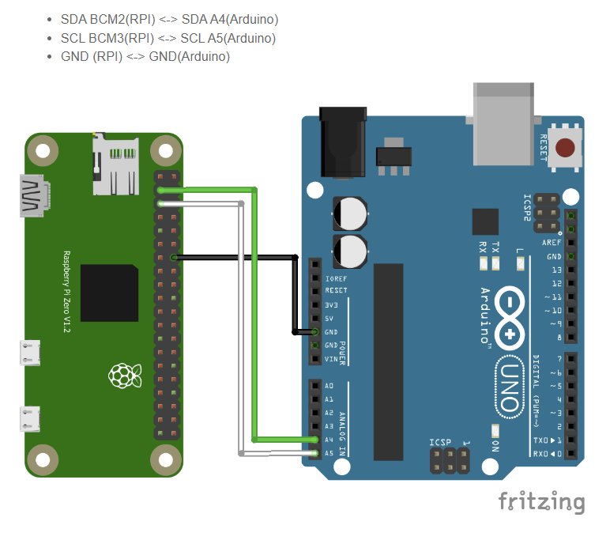

# Master Slave setup for Dummy Patient Snortur
# Activity Signals

## Table of contents
- General infor
- Setup
- Connections
- Explaining the code


## General info

Using I2C to implement master slave communication between devices to simplify the system for patient dummy Snortur. RaspberryPi is the master and Firebeetle ESP32 is the slave. Python language is used on the RaspberryPi, C++ is used for the Firebeetle. 


## Setup

Many slaves can be connected to one master. The slaves are assigned with different 8-bit addresses to define between them. 

Platformio(extension in VScode) is used to program the Firebeetle.

SSH interface (extension in VScode) is used to program the RaspberryPi.

Install smbus2 on RaspberryPi to be able to run the code.
```
>> pip3 install smbus2
```


Libraries used on Firebeetle ESP32, (are included at the top of the script.)


```
Wire.h

Arduino.h

stdlin.h 
```

To start running the Activity System the device needs to be in supine position whereas that is the starting position of the device. The code assumes that the device is in that position and then moves the device from supine to prone position, and then lateral right, left and then ends in starting position which is the supine position.


## Connections

The master/slave devices are connected through 2 GPIO pins the transmit and receive pins. 

•	Connect the SDA (I2C data) of the Pi (pin 2) to the Firebeetle SDA.

•	Connect the SCL (I2C clock) of the Pi (pin 3) to the Firebeetle SCL.

You should really pay attention when you connect 2 pins between those boards. Usually you’d have to use a level converter between 3.3V and 5V. But in this specific case we can avoid using one. (because the Firebeetle is a slave then it does not matter)
RaspberryPi runs og 3.3 V, Firebeetle on 5V.


Figure showing the connection between RaspberryPi and Arduino. Is similar to connecting between RaspberryPi and Firebeetle ESP32.  




Connecting the motor drivers to the stepper motors, hook up guide
![https://learn.sparkfun.com/tutorials/easy-driver-hook-up-guide?_ga=2.32874878.1720033674.1686652391-1195257050.1676371791]


## Explaining the code

__Raspberry Pi__ - using python

Importing libraries

```python
#library
import sys
import smbus2 as smbus
import time
```
Choosing addresses to acknowlegde between multiple slaves. In our setup we only use one for the Breath system. The slave address 11 is the one for the Breath system.
```python
# Slave Addresses
I2C_SLAVE_ADDRESS = 11 # address for slave number 1, BREATH
I2C_SLAVE2_ADDRESS = 12 # address for slave number 2, ACTIVITY
I2C_SLAVE3_ADDRESS = 13 # address for slave number 3
```
Function that is used to convert string to bytes to be able to send it over to the slave. The I2C communication transmits and recieves bytes only.
```python
# This function converts a string to an array of bytes.
def ConvertStringsToBytes(src):
  converted = []
  for b in src:
    converted.append(ord(b))
  return converted
```

main function, used to transmit and recieve data between master and slave. cmd is the string that is sent to the slave. The string needs to contain the letter g to activate the breath code in the slave/Firebeetle. Use only one g, not two, three or more. An example of a string is "go", "green", "g". Is also case sensitive. So only include small lettered g.
The string can not exceed the size of 14 characters. Because the maximum buffer is 15 in the Firebeetle. (an extra byte is transmitted from the master to the slave.)
```python
def main():
    # Create the I2C bus
    I2Cbus = smbus.SMBus(1)
    with smbus.SMBus(1) as I2Cbus:
        # slaveSelect = input("Which Firebeetle (1-3): ")
        slaveSelect = "2"
        # cmd = input("Enter command: ")
        cmd = "go"

        if slaveSelect == "1":
            slaveAddress = I2C_SLAVE_ADDRESS
            print("Slave 1 selected for breath signals")
        elif slaveSelect == "2":
            slaveAddress = I2C_SLAVE2_ADDRESS
            print("Slave 2 selected for activity signals")
        elif slaveSelect == "3":
            slaveAddress = I2C_SLAVE3_ADDRESS
            print("Slave 3 selected")
        else:
            print("Wrong slave selected")
            quit()
        BytesToSend = ConvertStringsToBytes(cmd)
        print("Sent to slave address: " + str(slaveAddress) + " the command: " + str(cmd))
        print(str(len(BytesToSend)) + " Bytes sent: ")
        print(BytesToSend)

        I2Cbus.write_i2c_block_data(slaveAddress, 0x00, BytesToSend)
        time.sleep(1)
        I2Cbus.read_i2c_block_data(slaveAddress,0x00,16)
        I2Cbus.write_i2c_block_data(slaveAddress, 0x00, BytesToSend)
        time.sleep(1)

        while True:
            try:
                data2 = I2Cbus.read_i2c_block_data(slaveAddress,0x00,len(BytesToSend)+1)
                print(str(len(data2)-1) + " Bytes recieved from slave: ")
                print(data2[1:])
                break
            except:
                print("remote i/o error")
                time.sleep(0.5)
    return 0
```

Run code
```python
if __name__ == '__main__':
    main()

```


__Firebeetle ESP32__ - using C++

Include libraries
```c++
#include <Wire.h>
#include <Arduino.h>
#include <stdlib.h>
```

Define the slave address
```c++
#define I2C_SLAVE_ADDRESS 12
```

Define global variables
```c++
// // GLOBAL variable
// Define a buffer for receiving data
char data_to_echo = 0;
int buffer[15] = {};
int counter = 1;
char flag_breath = 0;

// assign digital pins on FireBeetle
// for motorDriver1
const int step_MD1 = D2;
const int dir_MD1 = D3;
const int enable_MD1 = D4;

// for motorDriver2
const int step_MD2 = D5;
const int dir_MD2 = D6;
const int enable_MD2 = D7;

```
Function to reset configured pins
```c++
// put function declarations here:
void reset_pins()
{
  // MD1
  digitalWrite(step_MD1, LOW);
  digitalWrite(dir_MD1, LOW);
  digitalWrite(enable_MD1, LOW);
  // MD2
  digitalWrite(step_MD2, LOW);
  digitalWrite(dir_MD2, LOW);
  digitalWrite(enable_MD2, LOW);
}
```
Send data to master using the wire library.
```c++
// For I2C communication
void sendData()
{
  Serial.println("----> SENDING");
  int array_len = sizeof(buffer) / sizeof(int);
  flag_activity = 0;
  for (char j = 0; j < array_len; j++)
  {
    Wire.write(buffer[j]);
    Serial.print("sending buffer: ");
    Serial.println(buffer[j]);
    //  if has "g" in word then is activated
    if (buffer[j] == 103 && counter % 2 == 0)
    {
      Serial.println("EURIKA!");
      // PRESSURE FUNCTION HERE!
      flag_activity = 1;
      // breath_signals(5);
    }
  }
  counter++;
}
```

Receive data from master using the wire library.
```c++
// For I2C communication
void receiveData(int numBytes)
{
  Serial.print(numBytes);
  Serial.println(" bytes recieved");
  Serial.println(F("----> recieved events"));
  for (int i = 0; i < numBytes; i++)
  {
    data_to_echo = Wire.read();
    Serial.print("recieved value : ");
    Serial.println(data_to_echo);
    buffer[i] = data_to_echo;
  }
  Serial.println("BUFFER that is read");
  for (char m = 0; m < numBytes; m++)
  {
    Serial.print(buffer[m]);
    Serial.print(" ");
  }
  Serial.println();
}
```

The part of the code that is used to move the stepper motors
```c++

// ---- Moving motors ----
// Motor Driver1 moving 1/4th of a cycle clockwise
void MD1_quarter_cycle_CW()
{
  digitalWrite(enable_MD1, LOW);
  digitalWrite(enable_MD2, LOW);

  digitalWrite(dir_MD1, HIGH); // clockwise
  digitalWrite(dir_MD2, LOW);  // counter clockwise

  for (int x = 0; x < (50 * 8); x++)
  {
    digitalWrite(step_MD1, HIGH);
    digitalWrite(step_MD2, HIGH);
    delayMicroseconds(1000); // by changing this time delay between the steps we can change the rotation speed
    digitalWrite(step_MD1, LOW);
    digitalWrite(step_MD2, LOW);
    delayMicroseconds(1000);
  }
  delay(400);
}
// Motor Driver1 moving 1/2th of a cycle counter-clockwise
void MD1_half_cycle_CCW()
{
  digitalWrite(enable_MD1, LOW);
  digitalWrite(enable_MD2, LOW);

  digitalWrite(dir_MD1, LOW);  // counter clockwise
  digitalWrite(dir_MD2, HIGH); // clockwise

  for (int x = 0; x < (100 * 8); x++)
  {
    digitalWrite(step_MD1, HIGH);
    digitalWrite(step_MD2, HIGH);
    delayMicroseconds(1000); // by changing this time delay between the steps we can change the rotation speed
    digitalWrite(step_MD1, LOW);
    digitalWrite(step_MD2, LOW);
    delayMicroseconds(1000);
  }
  delay(400);
}
// Motor Driver2 moving 1/4th of a cycle clockwise
void MD2_quarter_cycle_CW()
{
  digitalWrite(enable_MD1, LOW);
  digitalWrite(enable_MD2, LOW);

  digitalWrite(dir_MD2, HIGH); // clockwise

  for (int x = 0; x < (50 * 8); x++)
  {
    digitalWrite(step_MD2, HIGH);
    delayMicroseconds(1000); // by changing this time delay between the steps we can change the rotation speed
    digitalWrite(step_MD2, LOW);
    delayMicroseconds(1000);
  }
  delay(400);
}
// Motor Driver2 moving 1/2th of a cycle clockwise
void MD2_half_cycle_CW()
{
  digitalWrite(enable_MD1, LOW);
  digitalWrite(enable_MD2, LOW);

  digitalWrite(dir_MD2, HIGH); // clockwise

  for (int x = 0; x < (100 * 8); x++)
  {
    digitalWrite(step_MD2, HIGH);
    delayMicroseconds(1000); // by changing this time delay between the steps we can change the rotation speed
    digitalWrite(step_MD2, LOW);
    delayMicroseconds(1000);
  }
  delay(400);
}
```


The test cycle runs while testing. The value into the function determines how many cycles are run. The sleep determines the interval between loops.
```c++
void test_cycle(int value)
{
  for (int i = 0; i < value; i++)
  {
    // rest position of device is in SUPINE
    // PRONE position
    MD1_half_cycle_CCW();
    delay(1000);
    // RIGHT LATERAL position
    MD1_quarter_cycle_CW();
    delay(200);
    MD2_quarter_cycle_CW();
    delay(1000);
    // LEFT LATERAL position
    MD2_half_cycle_CW();
    delay(1000);
    // resting position, SUPINE and motors sleeping
    MD2_quarter_cycle_CW();
    MD1_quarter_cycle_CW();
    // Putting the motors to sleep
    digitalWrite(enable_MD1, HIGH);
    digitalWrite(enable_MD2, HIGH);
    // If want to increase time interval between cycle then change sleep input
    // 5*60 is 5 minutes
    sleep((4 * 60) + (1 * 45));
  }
}

```

Setup function runs one time and initializes all pins and functions used in the code.
```c++
// initializing all pins and functions
void setup()
{
  Wire.begin(I2C_SLAVE_ADDRESS);
  Serial.begin(9600);
  delay(200);

  // MotorDriver 1
  pinMode(step_MD1, OUTPUT);
  pinMode(dir_MD1, OUTPUT);
  pinMode(enable_MD1, OUTPUT);
  // MotorDriver 2
  pinMode(step_MD2, OUTPUT);
  pinMode(dir_MD2, OUTPUT);
  pinMode(enable_MD2, OUTPUT);
  reset_pins();

  Serial.println(F("----------I am Slave2----------"));
  delay(100);
  Wire.onRequest(sendData);
  Wire.onReceive(receiveData);
}

```

The main loop runs continuously, when the Firebeetle receives a string incluing the character "g" the variable flag_activity turns to 1 and activates the if condition which then starts running the test_cycle function. The input into the test_cycle function controls the number of cycles that are run. For 1 hours recording the value should be 12. When the cycles are finished the variable flag_activity is zeroed. 
```c++
void loop()
{
  //   --- MOTORS SLEEPING ---
  digitalWrite(enable_MD1, HIGH);
  digitalWrite(enable_MD2, HIGH);

  if (flag_activity == 1)
  {
    // The value in function below: test_cycle can be modified to change number of runs.
    // The function runs at every 5 mins interval
    // if for 1 hour recording choose the input value 12
    // if 8 hour recording choose the input value = 8*12 = 96
    test_cycle(96);
    flag_activity = 0;
  }
}
```